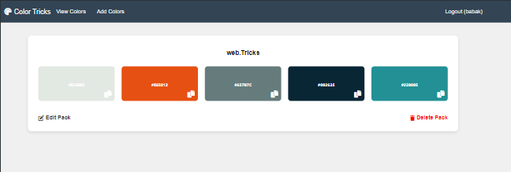
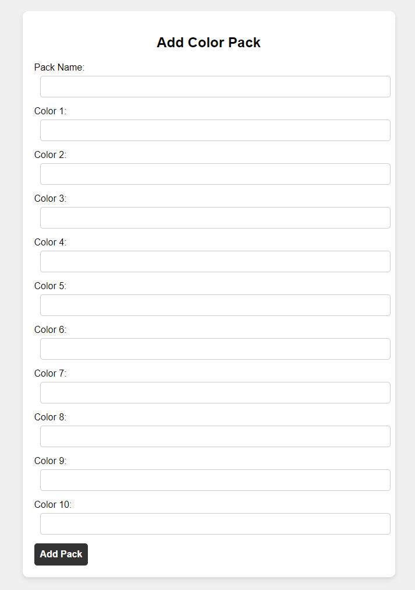

# Color Tricks

Color Tricks is a web application that allows users to manage their own color palettes. Users can add, edit, view, and delete color packs, each containing up to 10 colors. The application also includes user authentication for secure access to user-specific color palettes.






## Features

- **User Authentication**: Secure login and registration system.
- **Color Management**: Add, edit, and delete color packs.
- **User-Specific Palettes**: Each user has their own unique color palettes.
- **Responsive Design**: Works well on both desktop and mobile devices.

## Getting Started

These instructions will help you get a copy of the project up and running on your local machine for development and testing purposes.

### Prerequisites

- PHP 7.0 or higher
- MySQL
- Apache server
- Composer (for dependency management)
- Git (for version control)

### Installation

1. **Clone the repository**

   ```sh
   git clone https://github.com/6a6ak/Colors.git
 

CREATE DATABASE color_db;

USE color_db;

CREATE TABLE users (
    id INT AUTO_INCREMENT PRIMARY KEY,
    username VARCHAR(50) NOT NULL UNIQUE,
    password VARCHAR(255) NOT NULL
);

CREATE TABLE user_palettes (
    id INT AUTO_INCREMENT PRIMARY KEY,
    user_id INT,
    pack_name VARCHAR(255),
    color1 VARCHAR(7),
    color2 VARCHAR(7),
    color3 VARCHAR(7),
    color4 VARCHAR(7),
    color5 VARCHAR(7),
    color6 VARCHAR(7),
    color7 VARCHAR(7),
    color8 VARCHAR(7),
    color9 VARCHAR(7),
    color10 VARCHAR(7),
    FOREIGN KEY (user_id) REFERENCES users(id)
);

<?php
define('DB_SERVER', 'localhost');
define('DB_USERNAME', 'your_db_username');
define('DB_PASSWORD', 'your_db_password');
define('DB_NAME', 'color_db');

$mysqli = new mysqli(DB_SERVER, DB_USERNAME, DB_PASSWORD, DB_NAME);

if($mysqli === false){
    die("ERROR: Could not connect. " . $mysqli->connect_error);
}
?>

Add the following to your .htaccess file to deny direct access to relation.php.


# Deny access to relation.php
<Files "relation.php">
    Order Allow,Deny
    Deny from all
</Files>

Usage
Start the server

Make sure your Apache server is running and serving the project directory.

Online 

Open your browser and navigate to https://color.tricks.se

Register a new user

Use the registration form to create a new account.

Manage your color palettes

Add new color packs.
View your existing color packs.
Edit or delete color packs as needed.
Directory Structure
<pre>
   
color-tricks/
├── .htaccess
├── index.php
├── add_colors.php
├── edit_colors.php
├── delete_palette.php
├── register.php
├── login.php
├── logout.php
├── header.php
├── relation.php
├── styles.css
└── README.md
</pre>
Contributing
Please fork the repository and submit a pull request to contribute to this project. Contributions are welcome and appreciated!

License
This project is licensed under the MIT License - see the LICENSE file for details.


### How to Use

1. **Clone the Repository**:
   - `git clone https://github.com/6a6ak/Colors.git`
2. **Set Up the Database**:
   - Create a MySQL database and import the provided SQL schema.
3. **Configure the Database Connection**:
   - Update `relation.php` with your database credentials.
4. **Secure the `relation.php` File**:
   - Use the provided `.htaccess` directives to secure the file.
5. **Install Dependencies**:
   - If using Composer, install the necessary dependencies.

